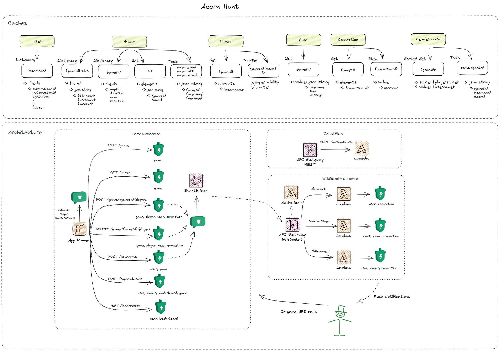

# Acorn Hunt

Welcome to the services that power Momento's very own game, *Acorn Hunt*!

In this repository, you will find a set of services that demonstrate different caching concepts using the different types of [collection data types](https://docs.momentohq.com/develop/datatypes) Momento offers. It also takes advantage of Momento Topics, a serverless event messaging service.

The game is intended to do two things:

* Show you there are more use cases for a cache than as a database relief (think creatively!)
* Highlight **all the capabilities** Momento has to offer
  * [Sorted Sets](https://docs.momentohq.com/develop/api-reference/collections/sortedsets)
  * [Sets](https://docs.momentohq.com/develop/api-reference/collections/sets)
  * [Dictionaries](https://docs.momentohq.com/develop/api-reference/collections/dictionary)
  * [Lists](https://docs.momentohq.com/develop/api-reference/collections/list)
  * [Cache Items](https://docs.momentohq.com/develop/api-reference#data-apis)
  * [Topics](https://docs.momentohq.com/develop/api-reference/topics)

## Dev environment

The development environment is the only active environment for *Acorn Hunt* at the moment. Below are the urls for the two APIs in this repository:

* **Control Plane API**: `https://ve42pfi5og.execute-api.us-east-1.amazonaws.com/demo`
* **WebSocket**: `wss://6wpfu6sgk1.execute-api.us-east-1.amazonaws.com/demo`

## Architecture

This repository uses AWS serverless services for the APIs. It takes advantage of API Gateway and Lambda for the control plane and AP Gateway v2 for the WebSocket.

## Supporting repositories

There are two other repositories that compose *Acorn Hunt*:

* [Game Microservice](https://github.com/momentohq/acorn-hunt-game-service)
* [User Interface](https://github.com/momentohq/acorn-hunt-ui)